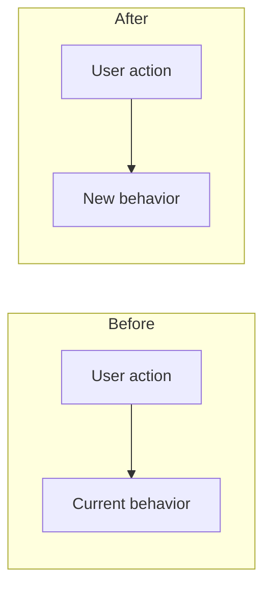
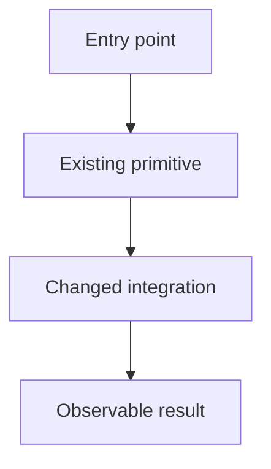

# Plan Visuals

Visuals serve the human reviewing the plan. Include the smallest diagram that makes a material relationship easier to verify; omit decorative diagrams.

## UX change

For a changed interaction or user flow, show before and after plus the user-visible difference. Mermaid or compact ASCII are both acceptable.

Add a small comparison table when several surfaces change:

| Surface | Before | After | User impact |
|---|---|---|---|
| `<route or component>` | Current behavior | New behavior | Why it matters |

## Architecture change

For changed ownership, boundaries, state, or data flow, show the relevant components and their relationships after the change. Add a before diagram only when the contrast explains the decision.

Label new, changed, and existing elements in text or diagram styling. Show boundaries that matter to implementation: process, service, package, persistence, external system, or trust boundary.

## Rules

- Diagram the chosen solution, not every rejected alternative.
- Keep labels in product and domain language.
- Reflect real control or data flow; do not imply connections the code will not have.
- Prefer one readable diagram over several exhaustive ones.
- Explain the design decision immediately below the diagram when it is not self-evident.
